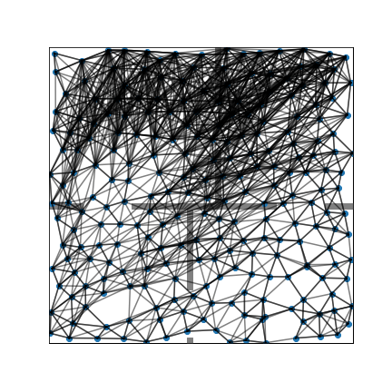

Repository for CSE257's Final Project

## Setup the environment

Please follow the original [sgm](https://github.com/XHwind/cse257_final_pj/tree/main/sgm) install instructions. And replace the `evaluation.py` and `planner.py` and `simple_navigation.py` with the one in the top folder. Those files are modified to support different functionality. 

## Running instructions

To directly tun the experiment, please run

```bash
python main.py
```

To use jupyter-notebook, please see the `exp.iphynb` and save the plots in the disired path. To generate simle plots and gif, please run 

```bash
python myplot.py
```

The GIF for the SGM with different cleanup steps are shown below.

